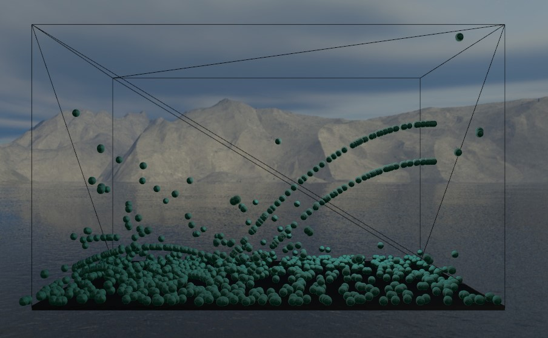
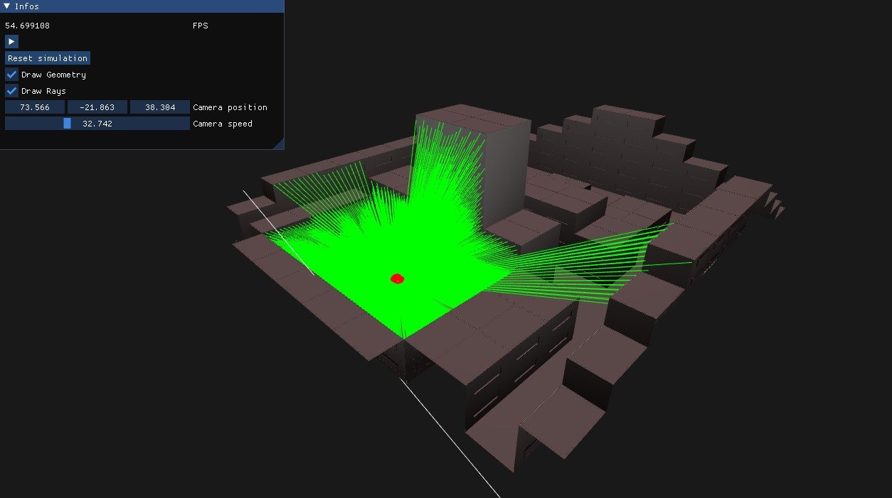

# Merlin
Merlin is a multipurpose 3D engine capable of drawing 3D objects in an OpenGL context.

The project is using ImGui, Glad, GLFW and stb_image as dependencies. They are already pacakged and pre-compiled in the project.

## Gallery 

### Fluids

### Pathtracing

### Physics

### Raycasted

