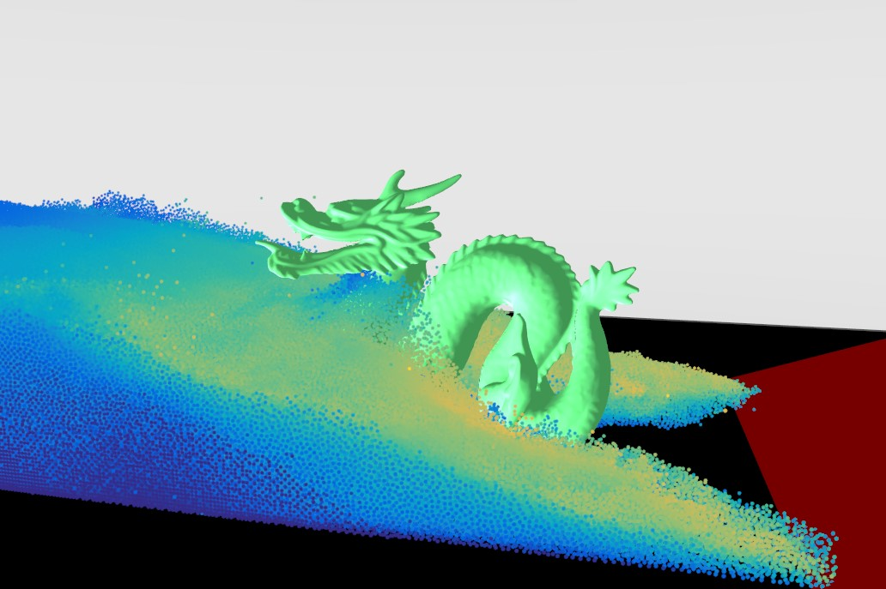
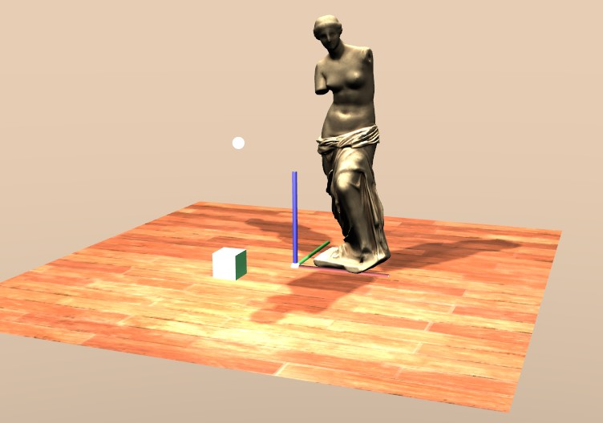
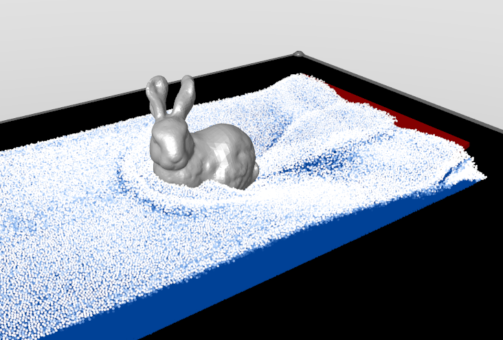

# Merlin



## Overview
Merlin is a GPU computing and rendering engine designed as a sandbox instead of CUDA or OpenCL. While still in development, Merlin offers basic 3D rendering capabilities and a compute shader pipeline. The framework is geared towards facilitating physics experiments, but it's worth noting that it's still evolving and might not yet match the full capabilities of more established tools.

Note: As Merlin is in development, this README aims to provide a balanced view of its current state, highlighting its potential while acknowledging its ongoing development status.

## Features
- **GPU Computing**: Utilizes GPU for computations, aiming to offer an alternative to CUDA.
- **Basic 3D Rendering**: Provides fundamental 3D rendering functionalities.
- **Compute Shader Pipeline**: Includes a pipeline for compute shaders, suitable for simple to moderately complex calculations.
- **Class Abstraction**: Offers class abstraction to ease the process of setting up and managing physics experiments.

## Getting Started
Merlin is in a developmental stage and might require some familiarity with GPU computing and rendering concepts.

1. **Clone the Repository**
```
git clone --recurse-submodules https://github.com/JulesTopart/Merlin.git
```

2. **Build the Engine**
   - Navigate to the Merlin directory.
   - Run `premake.bat` to generate Microsoft Visual studio projects and solution automatically.
   
   ```
   cd Merlin
   premake.bat
   ```
   
   Premake is packaged with Merlin inside the `extern folder`. You could also install premake on you machine and add it to your PATH environment variable to shorten the commands.
   
   To create a new project preconfigured for Merlin, use this command : 
   ```
   ./extern/premake5/premake5.exe new <projectname>
   ```
   
   or if you already have premake installed : 
   
   ```
   premake5 new <projectname>
   ```
   
   This command will create a new folder using the project template into the `merlin.projects` directory.
   

3. **Open MVSC Solution**
   - Open the `.sln` file in Microsoft Visual Studio.

## Example Usage
The code sample provided gives an insight into the usage of Merlin. It involves creating a camera, loading models, shaders, and managing a simple scene with lighting. It demonstrates the engine's capabilities in handling basic 3D objects and scene management.

**Rendering**



**Physics Sim**




## Limitations and Development Status
Merlin is a work in progress and may not yet be fully optimized or bug-free. Users should be prepared for potential issues and are encouraged to contribute to its development.

## Contributing
Contributions are welcome, especially in areas of bug fixing, feature enhancement, and documentation improvement. Please submit pull requests for any contributions.

## Support and Issues
For support or to report issues, please use the GitHub issue tracker associated with the repository.

## License
Merlin is released under CC BY-NC-SA. Please review the license terms before using or modifying the software.


## Credits

This project is built upon various OpenSource codes and tools.

- Marching cubes algorithm by [Michael Walczyk](https://michaelwalczyk.com/project-marching-cubes.html) inspired by explanation of [Paul Bourke](https://paulbourke.net/geometry/polygonise/).
- Signed distance function and rendering math by [Inigo Quilez](https://iquilezles.org/articles/distfunctions/)
- Model loading library : [Assimp](https://github.com/assimp/assimp) Even if Merlin can load models using the internal loader, it will fall back on Assimp for unsupported model formats.
- Graphical User Interface : [ImGui](https://github.com/ocornut/imgui) This library is used to make the super simple interface that make Merlin alive and interactive.
- OpenGL development kit : [GLFW](https://www.glfw.org/)


# References

- Position based fluids [Position based fluids by Miles Macklin and Matthias Müller](https://dl.acm.org/doi/10.1145/2461912.2461984)
- Smoothed Particle Hydrodynamics Techniques for the Physics Based Simulation of Fluids and Solids [A course on Smoothed Particle Hydrodynamics (SPH)](https://sph-tutorial.physics-simulation.org/)

